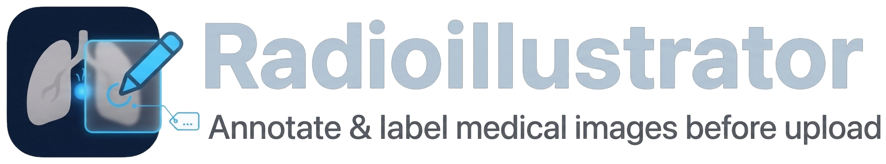

# RadioIllustrator

<picture>
  <source media="(prefers-color-scheme: dark)" srcset="public/logo-dark.png">
  
</picture>

RadioIllustrator draws colored overlays on a DICOM series and exports the annotated series for
a Radiopaedia case. A typical use is marking the spinal canal on every slice of a sagittal or
axial spine MRI. The app runs in the browser and reads the DICOM files on your computer.

Live version: <https://gmadevs.github.io/RadioIllustrator/>

In the app, **Help** shows this document and **GitHub** opens this repository.

## Running it locally

```bash
npm install
npm run dev
```

Open the address that Vite prints (usually http://localhost:5173). `npm run build` writes a
static build to `dist/`.

## Workflow

1. Drop a folder or DICOM files onto the window, or use **Open files** or **Open folder**. If
   the files hold more than one series, choose one in the menu next to these buttons.
2. The right panel has one structure, "Spinal canal". **+ New** adds another. Each structure
   has a name, a color, an opacity, and **outline** and **interpolate** checkboxes. The row of
   ten swatches sets one of the standard colors (red, orange, yellow, green, teal, cyan, blue,
   purple, magenta, brown). The square next to the name opens the system color picker for any
   other color.
3. Draw the structure on a few slices. Each slice you draw on becomes a key slice. The slices
   between two key slices are filled by interpolation. When you edit an interpolated slice, it
   becomes a key slice.
4. **Export…** writes the series with the overlay in the pixels.

The strip above the slice slider shows the slices of the active structure: key slices as
full-height marks, interpolated slices as short marks, and empty key slices as outlined marks.

**Clear slice** turns the current slice into an empty key slice. Between the last drawn key
slice and this one, the structure shrinks linearly and is gone at this slice. **Remove key
slice** gives the slice back its interpolated shape.

**Legend on the image** shows a box with the structure names and colors in the lower left
corner. The export can include the same box.

### Tools

| Tool | Key | Use |
|---|---|---|
| Brush | B | paints; hold Alt to erase |
| Eraser | E | erases |
| Polygon | P | click to add vertices; close with Enter, a double click or a click on the first vertex; hold Alt while pressing Enter or clicking the first vertex to subtract |
| Pan | H | moves the image; Space or the middle mouse button also pan |

**Size** sets the brush radius in image pixels, from 0.5 to 40.

### Shortcuts

| Input | Action |
|---|---|
| Mouse wheel, arrow keys, Page Up, Page Down | previous or next slice |
| Home, End | first or last slice |
| Ctrl or ⌘ + wheel | zoom |
| Right-button drag | window: horizontal changes the width, vertical the level |
| `[`, `]` | smaller or larger brush |
| `C`, `Shift+C` | copy the mask from the previous or the next slice |
| Backspace | remove the last polygon vertex |
| Esc | cancel the polygon |
| `O` | hide or show the overlay |
| `F` | fit the image to the view |
| ⌘Z or Ctrl+Z | undo |
| ⇧⌘Z, Ctrl+Shift+Z or Ctrl+Y | redo |
| ⌘S or Ctrl+S | save annotations |

Undo keeps the last 200 edits.

For CT series, the **Window** menu has three presets: soft tissue (40/400), bone (400/1800) and
canal/cord (40/250). The other entries are the window stored in the DICOM file and an automatic
window from the 1st and 99th percentiles of the image.

### Interpolation

Each key slice is converted into a signed distance map, in pixels: negative inside the mask and
positive outside. For a slice between two key slices, the two maps are moved to the
interpolated centroid and averaged. The mask is the part below zero. The method works for brush
and polygon masks alike, and for a structure that changes position from slice to slice. It
gives poor results when a structure splits in two between two key slices. In that case, draw
an extra key slice between them.

## Export

- **PNG** or **JPEG**: numbered images (`001.png`, `002.png`…) for a manual upload to
  Radiopaedia.
- **DICOM Secondary Capture** (RGB, explicit VR little endian): a new series in the same study.
  It keeps the StudyInstanceUID, has a new SeriesInstanceUID and SeriesNumber 9001, and copies
  the position, orientation and InstanceNumber of each source slice. See
  [Uploading with Radiouploader](#uploading-with-radiouploader).
- **Also the same series without overlay**: the same slices without color, with SeriesNumber
  9002 and the same window and scale. The two series can be shown side by side as a
  before/after pair.

The export uses the window currently on screen. **Scale** enlarges the image 2× or 3× and
divides PixelSpacing by the same factor. The default is 2× for series less than 400 pixels
wide and 1× otherwise. **From slice** and **To slice** limit the export to a range, and
**Annotated range only** sets them to the first and last annotated slice.

**Download zip** saves a zip file. It has an `annotated/` folder and, if you chose the series
without overlay, an `original/` folder. Each has a `png/` or `jpeg/` folder and a `dicom/`
folder, depending on the formats you chose. In Chrome and Edge, **Save to folder…** writes the
same folders into a folder you pick.

**The exported DICOM files contain the patient data of the source series.** Anonymize them
before you share them. Radiouploader anonymizes them when it uploads. The PNG and JPEG files
contain no patient data.

## Uploading with Radiouploader

[Radiouploader](https://github.com/gmadevs/Radiouploader) is a desktop app that anonymizes a
DICOM study and uploads it to Radiopaedia as a draft case. It can upload the Secondary Capture
series from RadioIllustrator together with the original series.

1. In **Export…**, tick **DICOM Secondary Capture (for Radiouploader)**. In **Series
   description**, type the name the series should have on Radiopaedia.
2. Unzip the export. Put its `annotated/dicom` folder, and `original/dicom` if you exported it,
   in the folder that holds the original DICOM study.
3. Drop that folder onto Radiouploader, or open it with **Choose folder**. Radiouploader also
   reads subfolders.

Radiouploader lists the annotated series in the same study as the original series. It appears
as a separate series with SeriesNumber 9001 and your description, with the slices in their
original order. Radiouploader uses Radiopaedia's anonymizer. It removes the patient name and ID
and leaves the series description, the slice positions and the pixels as they are.

Check three things in Radiouploader:

- The anonymizer warns that the series description may contain personal data. It gives this
  warning for every long text field. The description is the text you typed in the export
  dialog, so make sure it has no patient data.
- Radiouploader applies its window setting only to grayscale images. The annotated series is
  in color, so it keeps the window you set in RadioIllustrator before the export.
- A legend is text in the pixels. Radiouploader's burnt-in text check may mark it. The legend
  holds only the structure names.

These steps were tested with Radiouploader 1.5.6. The test ran its import and anonymizer code
on a CT series and on the Secondary Capture series exported from it. It did not include an
upload to Radiopaedia.

## Saving your work

The browser keeps an automatic copy of the annotations for each series, in localStorage. When
you open the same series again, the annotations are restored. This copy belongs to the site
address: annotations made on `localhost` are not available on the GitHub Pages version.

**Save annotations** downloads a `.radioillustrator.json` file with the key slices in
run-length encoding. **Load annotations** opens such a file on the same series. You can also
drop the file onto the window. The interpolated slices are computed again after loading.

## Privacy

The browser downloads the app's HTML, JavaScript and CSS from GitHub Pages. GitHub receives
this request like any other page request, with your IP address and browser details. The DICOM
files are read, edited and exported in the browser.

The app's code makes no network requests. The published build also sets a Content Security
Policy. `connect-src 'none'` makes the browser block fetch, XMLHttpRequest, WebSocket and
beacon requests from the page. The other directives allow scripts, styles and images only from
the site itself. The policy does not apply to links you click, such as **GitHub**. It is set in
`vite.config.ts` and is part of `npm run build`. The development server (`npm run dev`) does
not use it, because Vite's live reload needs a WebSocket.

The automatic copy and the `.radioillustrator.json` file contain the masks, the structure names
and colors, the image size and the SeriesInstanceUID. They contain no pixel data and no patient
data. Exports are created in the browser and saved as a download or into the folder you pick.

## Limitations

- Only uncompressed transfer syntaxes can be read: implicit VR little endian, explicit VR
  little endian and deflated. A series in JPEG, JPEG 2000 or RLE is refused with a message.
  Export it uncompressed from the PACS.
- Pixels are drawn square. A series whose row and column spacing differ appears stretched.
- Enhanced multi-frame files are split into their frames in the order of the file. The
  per-frame functional groups are not read.

## Code layout

| File | Contents |
|---|---|
| `src/dicom/load.ts` | reading files, grouping by series, sorting along the slice normal |
| `src/dicom/write.ts` | Secondary Capture writer |
| `src/mask/raster.ts` | brush, polygon fill, run-length encoding |
| `src/mask/interpolate.ts` | distance transform and interpolation |
| `src/model.ts` | structures, key slices, undo, annotation files |
| `src/render.ts` | image and overlay compositing, used by the viewer and the export |
| `src/export.ts` | PNG, JPEG and DICOM output, zip, saving to a folder |
| `src/main.ts` | user interface |

The logo source is `design/logo.jpeg`. `python3 design/make-logo.py` (needs Pillow) makes the
transparent logos `public/logo.png` and `public/logo-dark.png`, and the icons
`public/favicon.png`, `public/apple-touch-icon.png` and `public/icon-512.png`.

`npm test` runs `tests/core.test.ts`. If `~/radiouploader-sample` exists, the tests also load
the DICOM files in it.

Each push to `main` runs the tests, builds the site and publishes it on GitHub Pages
(`.github/workflows/pages.yml`).
